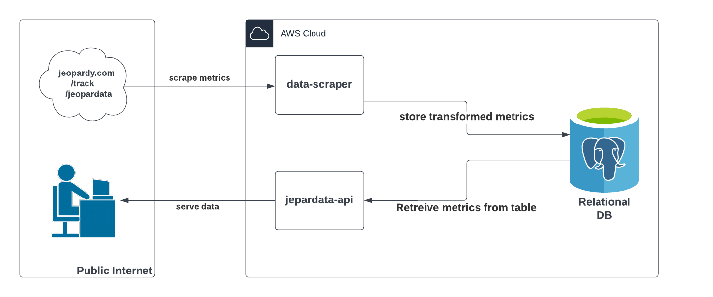

# jeopardata-api
An API for getting Jeopardy Game box scores objects, extracted and transformed from [Jeopary's Jeopardata webpage](https://www.jeopardy.com/track/jeopardata).
For more information about how that data is extracted and transformed, see [the jeopardy-data-scraper project](https://github.com/GeorgeDiNicola/jeopardy-data-scraper/blob/main/README.md)

## Design Goals
- Provide an API and file export mechanisms for data analyst Jeopardy fans to easily explore Jeopardata
- Provide a location to store historic Jeopardy! data in a transformed format more suitable for data-driven analysis and applications

## System Design

*Application scheduled to execute once per day after the Jeopardata posts to extract the most recent Jeopardy episode data it does not know of, then saves it to the DB.

## API Endpoints
| Operation | Endpoint                           | Description |
|-----------|------------------------------------|-------------|
| GET       | `/v1/episodes`                     | Basic Information. Retrieves a list of episodes, optionally filtered by date range or specific attributes like episode number. **Params:**<ul><li>`startDate` (optional)</li><li>`endDate` (optional)</li><li>`episodeNumber` (optional)</li></ul> |
| GET       | `/v1/episodes/{episodeNumber}`     | Game Episode Information. Retrieves detailed information about a specific episode, including contestant details and scores. **Params:**<ul><li>`episodeNumber`</li></ul> |
| GET       | `/v1/episodes/{episodeNumber}/performance` | Game Episode Information. Retrieves information about contestants, potentially filtered by name, home city, or state. **Params:**<ul><li>`episodeNumber`</li><li>`gameWinner` - filters for game winners (i.e. game champion stats only)</li></ul> |
| GET       | `/v1/contestants`                  | Contestant Information. Retrieves information about contestants, potentially filtered by name, home city, or state. **Params:**<ul><li>`lastName` (optional)</li><li>`firstName` (optional)</li><li>`homeCity` (optional)</li><li>`homeState` (optional)</li></ul> |
| GET       | `/v1/export`                       | Data Export. Exports all of the data to the user's web browser. **Params:**<ul><li>`fileType` (default: csv)</li></ul>Supported data types: CSV, XLSX, JSON, Google Sheets |